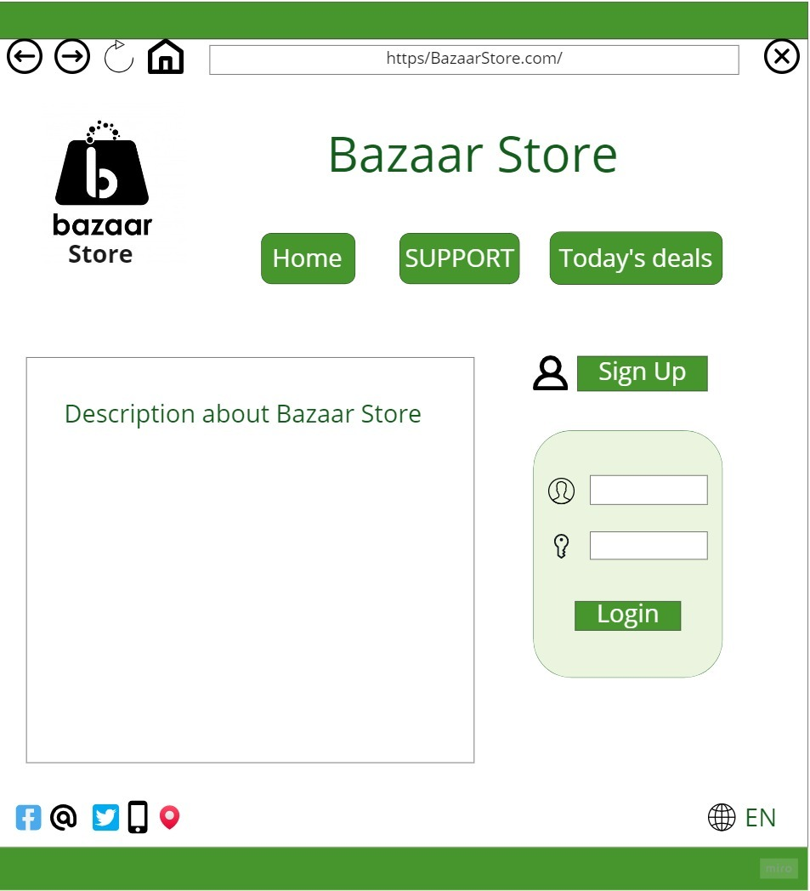

# Bazaar Store

## Developer Team
- Alaaldin alhanini
- Haneen Al-Hamdan

## Introduction

This is an e-commerse website build for selling of any products online. In this project we have mainly considered to adding the products to the users cart, adding the products to the  company and again let them decide the amount of item to buy. The users can increase or decrease the items amount in the cart. After that the user may pay and get the order successful. The Project also uses the mail facilities to the users.

# Problem Domain

With the rapid progress and development of technology and communication, we have to ensure that we automate all ideas and creative projects we may have, we should keep track with the updates happen everyday in the world of technology field, besides these days all activities should be done quickly.

from this point and because we belive that selling and buying is part and parcel in our life, it's an important operation we do every day, we decide to help people by creating an online website that they can sign up and  explore categories with all related products details like: name of product from which category does it came, and other informations customer may need to complete shopping operation, he/she will have a  message when they for example do something wrong like search for product we don't have and so on.

## Wireframes

- Description

- payment

- SignUp Page

- Cart Page 

- Admin add productes

- Companies Admin

- Companies 

## User Stories

1. As a new user, I want to register by creating a username and password so that the system can remember me and my data,
I should have a valid username and password to meet validation rules by the web application, and keep trying to fix register issues if occur .

2. As a registered user, I want to be able to securely log in to the system so that my information can only be accessed by me.
the system can authenticate me and I can trust it.

3. Admin
Log in to the site as an administrator Entering company data add products

4. User
Log in as a user Click the company you want to buy from Add products to the bag Make sure of the products you want to buy Pay the total amount for the products

## Domain Modeling

Basket ER digram 

